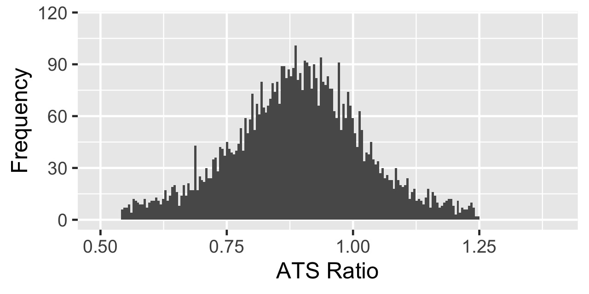
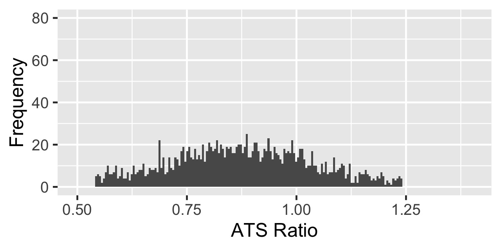
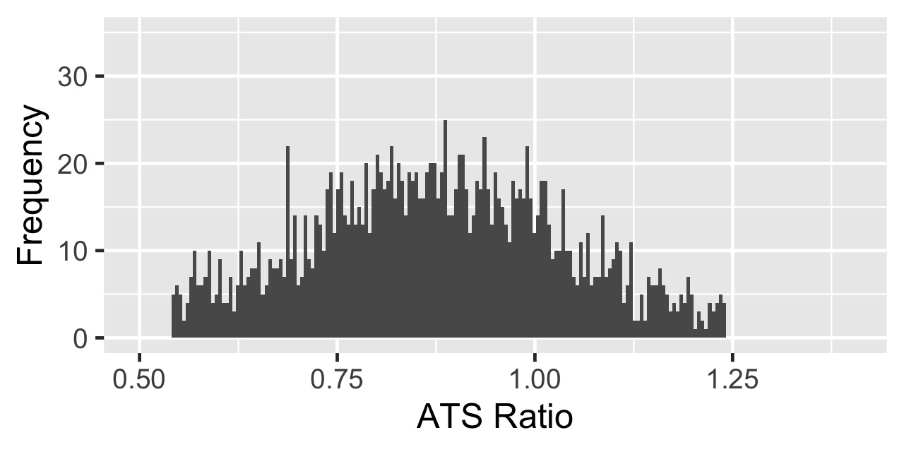
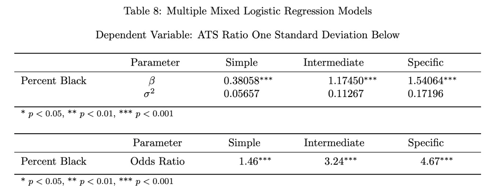

+++
author = "Vinnie"
title = "Milwaukee ATS Ratio Distribution"
date = "2020-01-18"
tags = [
    "inference",
    "Milwaukee",
    "Assessment to Sale Ratio"
]
categories = [
    "Milwaukee"
]
image = "rando.jpg"
+++

I had the opportunity to research the City of Milwaukee's housing market. The Assessor's Office of Milwaukee provided the data. 

While playing around with data visualizations I noticed something. The distribution of the Assessment to Sale (ATS) ratio looks like this:

If you recall, in my previous post I mentioned that I snipped observations outside the 1.5 x IQR (inter-quartile range). This made the data look very normal, a pretty bell curve.

Because I grabbed data from the American Community Survey (ACS), I could determine the neighborhood demographics of observations. I plotted the distribution of ATS ratios for house sales in majority black neighborhoods, which looks like this:

That looks.. different from the overall distribution. Much flatter. Left Tailed. I thought maybe this was due to the lower number of oberservations in this category. If we zoom in, would the distribution look similar to the overall?

... I'd say no.

Ok. It's visually obvious that these distributions are different, but how can we inspect this statistically? We want to know if homes in majority black neighborhoods are more likely to have lower ATS ratios. The word "likely" brings Logistic Regression to mind. How can we apply it in this case?

I created an indicator variable. If a home sale had an Assessment to Sale ratio one standard deviation below the average I assigned it a 1. This indicator is our response! We now have a (0,1) outcome, so Logistic Regression is viable! Cool.

As in the previous analysis, I used Hierarchical Mixed Modeling to capture the variance in the spatially correlated data, i.e. Census Tract was used as a Random Effect. Also, I did propensity score matching to compare homes in majority black neighborhoods to similar homes in non-majority black neighborhoods. This is a quasi-experimental setup that makes observational studies more robust.

The results were wild. In the final model, which controls for the most tract-level & home-level characteristics possible, a one standard deviation increase in the Percent Black Population corresponded to a 367% increase in the odds of an ATS ratio one standard deviation below the mean. 

That's one of the largest odds ratios (4.67) I have ever seen in real data. I have never seen an analysis like this, so if anyone knows a fatal statistical error I have committed email me!

Here is the final table:

If you want to slog through my full interpretation of all the results check out the paper [here.](https://github.com/Vinnie-Palazeti/Milwaukee-Property-Assessment/blob/master/Final%20Paper%20%26%20Presentation/Milwaukee%20Final%20Report.pdf) 

