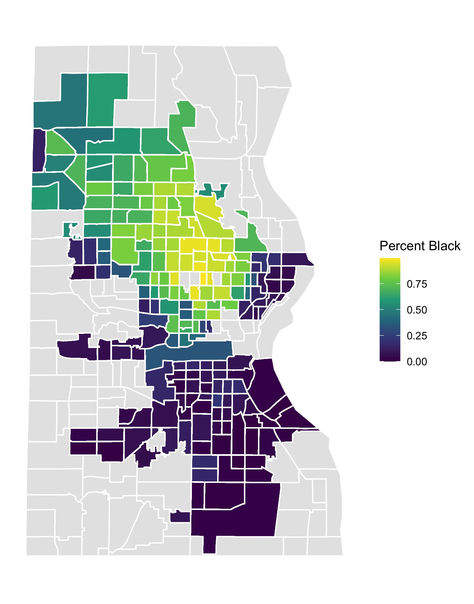
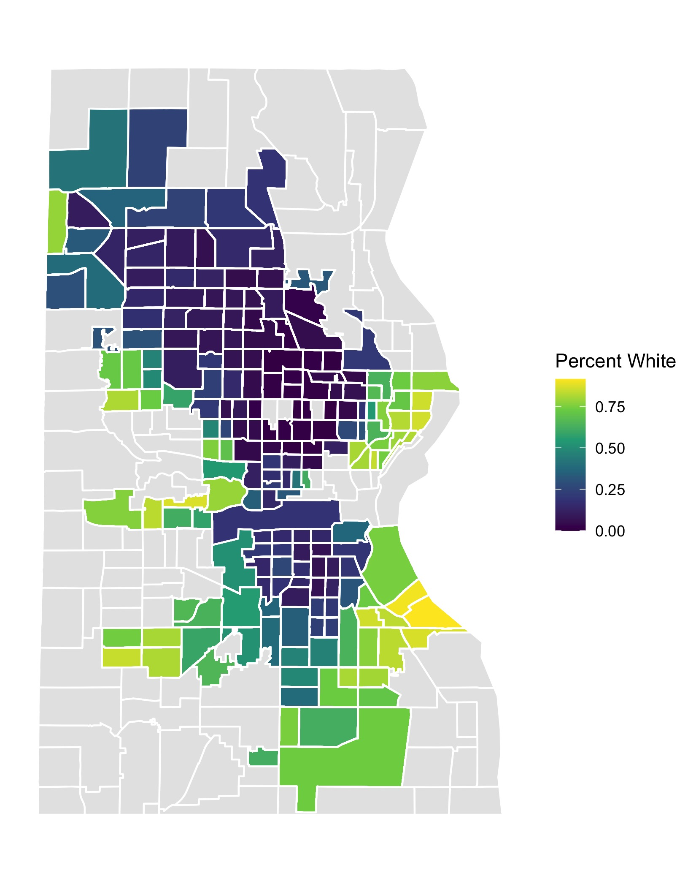
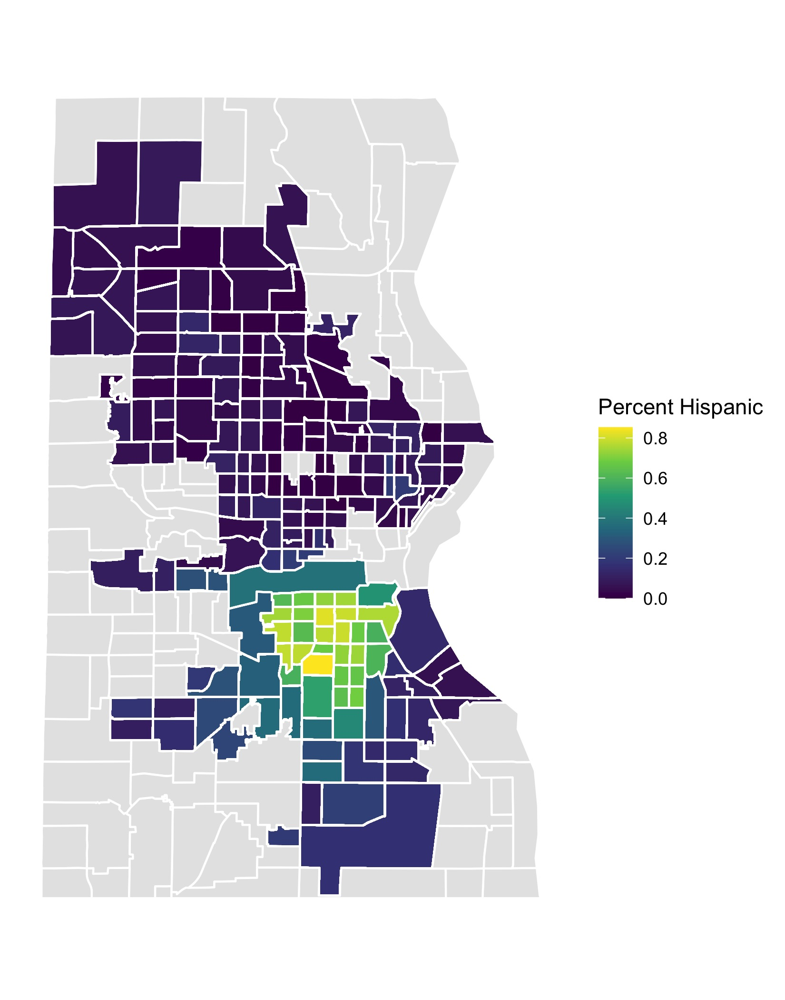

+++
author = "Vinnie"
title = "Milwaukee Population"
date = "2020-01-08"
tags = [
    "Milwaukee",
    "Visualzation",
    "Geo-Mapping"
]
categories = [
    "Milwaukee"
]
image = "His_pop.jpg"
+++

I had the opportunity to research the City of Milwaukee's housing market. The Assessor's Office of Milwaukee provided the data. 

This was my first ever Map Visualization. It's a pretty wild start if you ask me. I wrote some python [code](https://github.com/Vinnie-Palazeti/Census/tree/main/CensusData) that queries the Census API. This data came from the American Community Survey (ACS) five year estimates.

The population stratification in Milwaukee is striking. These images are almost non-overlapping sets; it really blows my mind.

Just below the mid section, there is a circular area that is dark blue in both plots. This is where the Hispanic population lives. 

