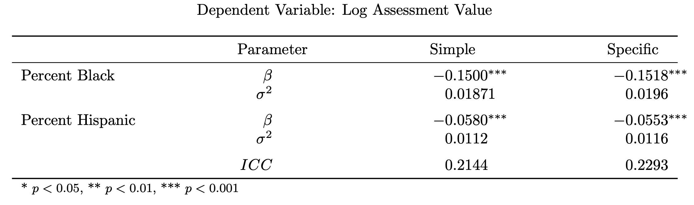

+++
author = "Vinnie"
title = "Milwaukee Assessment Project"
date = "2020-01-01"
tags = [
    "inference",
    "Milwaukee",
    "Assessment to Sale Ratio"
]
categories = [
    "Milwaukee"
]
image = "rando.jpg"
+++

I had the opportunity to research the City of Milwaukee's housing market. The Assessor's Office of Milwaukee provided the data. The research goals provided by the office were:

1. Identifying how market trends differentially impact communities of color and varying
socioeconomic status; and

2. Determining whether Milwaukee property assessments change disproportionately
according to demographic factors.

The data was 8500 home sales from 2018 to 2019, which included 60 house characteristics, e.g. Building Type, Number of Rooms, Kitchen Quality, Overall Condition, Square Footage, etc. Two of these measures, Sale Price & Assessment Price, comprise the variable of interest: The Assessment-to-Sale Ratio (ATS). This is the Assessment Price divided by the Sale price. The ATS ratio measures assessment precision. An ATS ratio below 1 indicates an underassessment, while a value above 1 is an overassessment. The mean ATS ratio is not of concern. If the average ATS ratio is 0.9, and observations are normally distributed around that value, then everyone is misassessed equally. This situation is fine. Issues arise when homes are misassessed in predictable ways. The Assessor's Office wanted to know if demographic factors, specifically racial and/or economic, affected home assessment. 

Each observation had the Census Tract where the home resided, so The American Community Survey (ACS) had the demographic data I needed. The ACS has a wild number of variables, like 27,000 or so. Pulling this info from the Social Explorer website is annoying, so I used Python to query the API. 

Check it out: https://github.com/Vinnie-Palazeti/Census/tree/main/CensusData. 

I adapted code I found online to most of the geographies the ACS API provides. With this script I pulled Hispanic, Black, and Not-Hispanic White Population, Median Income, Renter-Occupied Housing Units, Income-Below-Poverty Population, etc.

I won't bore you with the data cleaning. There was a lot.

The end goal is to employ multivariate regression techniques to assess the effect that population demographics have on the ATS ratio. Before I could jump into modeling, though, there were several obstacles. 

First, observations in regression must be Independent & Identically Distrbuted. My data breaks this rule. Homes within the same neighborhood are spatially correlated. Therefore, to capture the variance associated with this correlation I used a Hierarchical Linear Model. This is a fancy way of saying I coded Census Tract as a Random Effect, which is a fancy way of saying each Census Tract shares a common variance. With this method, I can determine the variance *within* and *between* Census Tracts, while also not violate an assumption of regression. Very good.

Next, the ATS ratio is exactly that: a ratio. This breaks another rule of regression, namely that the outcome ought to be continuous. Many dispatch this rule, especially when dealing with percentages (ratios bounded [0,1]). This can lead to absurd predictions above or below the bounds. The ATS ratio is different; it is bounded by [0,∞]. This poses interesting issues. 

I found a 1933 article by Richard Kronmal discussing a toy dataset provided by Neyman. Kronmal says that regression coefficients in this situation are actually the joint effect, or interaction, of the coefficient and the denominator of the dependent variable. So, when regressing on the ATS ratio, each covariate in the model is actually an interaction term of Sale Price (denominator of ATS ratio). This is wild. Due to this complexity, I opted to run two sets of models. The first using the ATS ratio as the dependent variable, and the second using Assessment Price as the dependent variable and including Sale Price as a covariate. The latter structure seems more appropriate to me.

Then, I noticed that for each Census Tract, the population of Black, White, and Hispanic people constituded roughly 95% of the population. In regression, covariates which are ratios with a common denomicator provides the same information. For example, each side of a percentage, say 0.6 and 0.4, relays the same information. Including both is not appropriate. 

This is the situation with Milwaukee's demographics. Where the population of Black people is 60%, the population of Whites is 25 to 35%, with Hispanics filling in most of the remaining gap. Therefore, including all three is no good. I opted to include only Black and Hispanic populations as independent variables, which are the specific variables of interest in this study.

Finally, building high dimensional models has always felt like soft p hacking. Using 50 covariates and selectingly inferring on significant findings strays, in my opinion, so far from traditional experimental statistics that it renders the whole project null. Research decisions, even those made **prior** to data analysis, [shape statistical findings.](https://citeseerx.ist.psu.edu/viewdoc/download?doi=10.1.1.694.7217&rep=rep1&type=pdf) Therefore, I setup this analysis to only infer upon the independent variables of interest, namely Percent Black Population and Percent Hispanic Population. All other covariates are controls.

I used HLMs to determine the effect of Percent Black and Hispanic population on assessment values. The models produced significant negative effects for both variables. The Simple vs Specific setup was used to determine if increasing the specificity of housing characteristics increased or decreased the effect of population demographics. I've seen this methodology used in observational studies, though the results, to my knowledge, can't be quantified statistically. I believe the intuition is that including more precise housing characteristics ought to decrease the effect of population demographics, if the market valued the former over the latter. In the ATS ratio models I find that increasing home characteristics actually **increases** the effect of population demographics. However, the models with Assessment Value as the outcome variable produce mixed results. 

All variables were scaled & centered prior to regressing. Therefore, a one standard deviation change in a coefficient is associated with a percent standard deviation change in the outcome. In table six we see -0.1218 as the coefficient for Percent Black in the Simple model. The interpretation is: a one standard deviation increase in the percent Black population is associated with a 0.12 standard deviation decrease in the assessment ratio. This is 12% of a standard deviation. The standard deviation of the assessment ratio, in our data, is about 0.13, so 12% of this is 0.016 or 1.16%. Therefore, observations in a neighborhood with a one standard deviation increase in the percent Black are subject to about a 1.16% decrease in their ATS Ratio.

In the Specific model we see this coefficient jump to −0.4642, which relates to a 6.14% decrease in their ATS Ratio. This is a significant decrease. When properties are over- or under-assessed differently, tax revenue is disproportionately raised. Our model reports that there is a decrease in assessment as the Percent Black or Hispanic rises, which results in lower taxation. Though, taxation is not the only concern; accessing credit could be made increasingly difficult through consistent underassessment. 

Here are the results from the models using Assessment Price as the dependent variable. Coefficients can be read in the same way as above.

Interpretation should be done cautiously. Attempting to nail down the specific percentage effect of any single parameter is difficult in high dimensional modeling. Therefore, I opt to take a holistic overview. I observe a constant, negative, and significant impact from Percent Black and Percent Hispanic. I infer from these facts that a negative relationship exists between these parameters and their respective dependent variable.

If you want to slog through my full interpretation of all the results check out the paper [here.](https://github.com/Vinnie-Palazeti/Milwaukee-Property-Assessment/blob/master/Final%20Paper%20%26%20Presentation/Milwaukee%20Final%20Report.pdf) 

