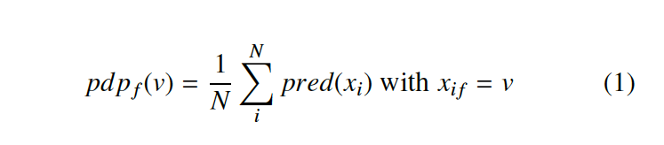
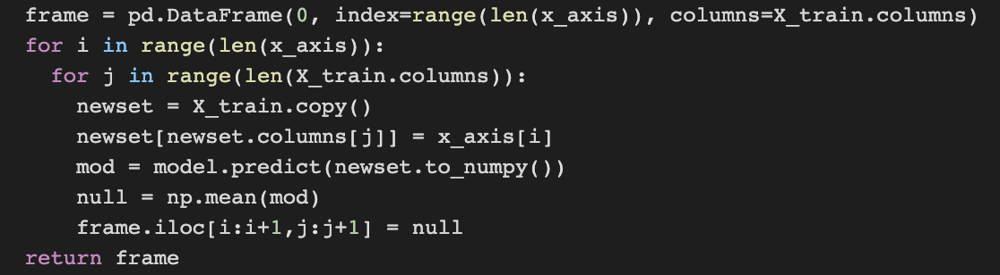
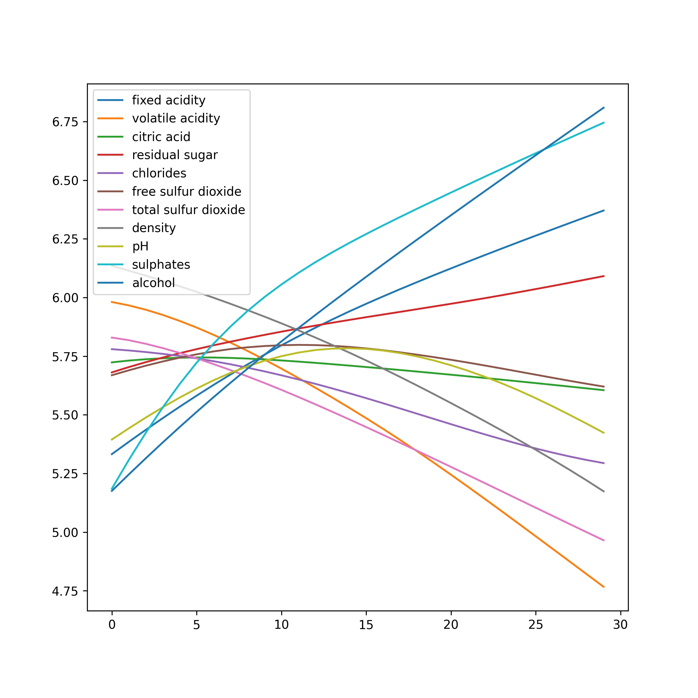
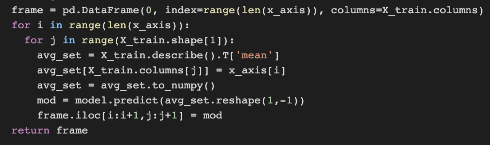
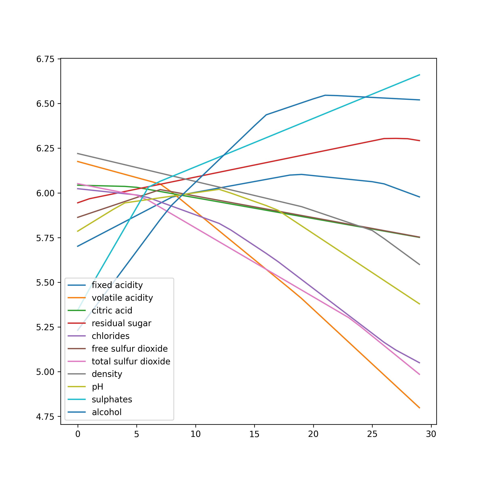
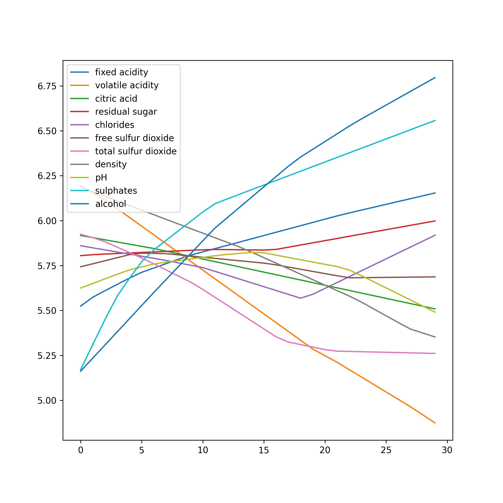
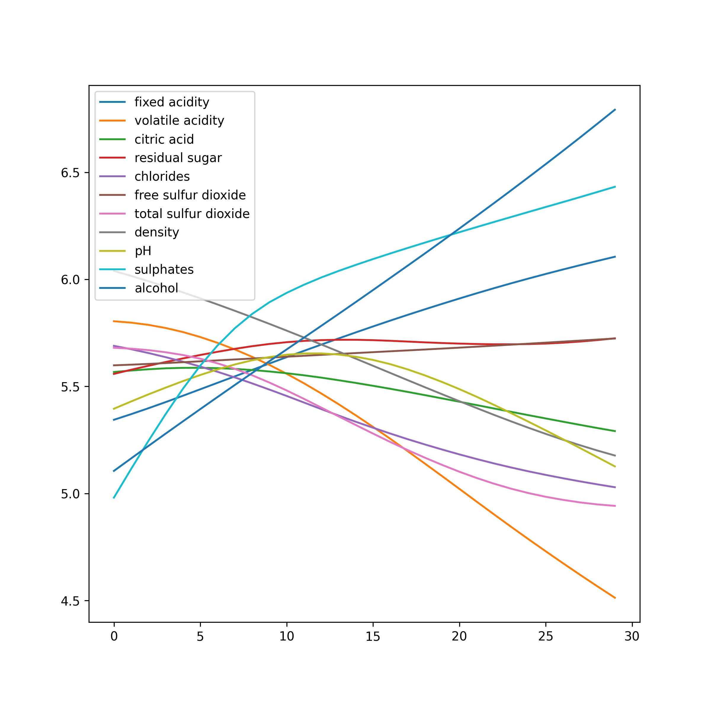

+++
author = "Vinnie"
title = "Variable Effect Curve"
date = "2020-01-01"
tags = [
    "inference",
    "machine learning",
    "regression",
    'visualization'
]
categories = [
    "inference",
    "machine learning",
]
image = "header.jpg"
+++

Prediction is cool, useful, and good. I, for some reason, am not impressed by it, especially with continuous outcomes. Every time I fit a Deep NN, XGBoost, LASSO, Random Forest, etc. I am left empty. My MSE is incredibly low. Hurray. Why is this the case? What variables are important? To what degree is each imput important? 

I understand the different goals of inference & prediction, but these methods are so powerful; they must be holding important information! I am interested in individual or joint inference on inputs to deep neural nets with continuous outcomes.

There are proposed inference methods. Guidotti (2018) provides a survey of the literature. He lays out four main definitions for "Black Box Model Explanation." Three of which involve implementing a secondary model, outside of the neural net, that provides easier to understand rules for prediction. A decision tree is an example of such a secondary model. The last defintion, the one that interests me, he calls the Black Box Inspection Problem, which is defined as:

>Given a black box predictor b and a dataset D = {X, Y}, the black box inspection problem consists in finding a function f : (X → Y) × (X^n × Y^n) → V which takes as input a black box b and a dataset D, and returns a visual representation of the behavior of the black box, f(b, D) = v with V being the set of all possible representations.

There are other methods, which construct test statistics using derivatives of node weights, but I am uninterested.

The Variable Effect Curve (VEC)

Krause (2016) implements a VEC, overlayed with other graphics, for a classification problem. A VEC plots the Partial Dependence with fixed feature values on the x-axis, and the corresponding outcome probability on the y-axis. 

There are two ways to find the probability at each input values. The formula recommended by Krause et al. is:

where *pred* is the prediction function, x_i is the input vector, v is the input value, and N is the number of rows in the design matrix. Every value for the feature in question is changed to v, then the prediction function is used on the new design matrix, and finally predictions are averaged. This process is iterated over a specific interval of v's, usually the range of the feature.

The other method is to predict using the average level of all inputs other than a specific feature, which is iterated over its range. Both seem like valid approaches, while the latter could run into issues with dummy variables. If a covariate is either a 1 or 0, what does it mean to use an average, say 0.36, in prediction? I can't think of a statistical reason of why this is flawed, but it doesn't pass the intuition check.

I implemented both versions of the Variable Effect Curve in python using the Wine Dataset. As noted above, I am interested in continuous outcomes. Therefore, this is not a classification problem, and (again) therefore I cannot use predicted probabilities. The outcome variable is wine quality, which has the range [3,8]. Instead of probabilites, I used the predicted outcome: wine quality score.

The covariate ranges are wildly different, so prior to modeling I scaled the predictors to [0,1]. Then, to predict over their "range", I used 30 equally spaced values as inputs. I did this individually for each predictor. Here is the code for the former approach, which changes every value of a feature in the design matrix to one of the 30 "v" values

and the visual output 

What I love about this is how incredibly interpretable it is. The positive effect alcohol & fixed acidity is clearly stated. Nice.

Here is the code for predicting on the average value of each input, only iterively altering a single feature over the equal spaced range of v

and the visual

The general trends remain true, though the predictions with this formula are more irratic. 

An issue with VECs used with deep nn models is the stocastic optimization function. Stocastic Gradient Descent or ADAM will usually not produce the same node weights in consecutive runs. This means that our graphs could look different, sometimes wildly different. Here is another VEC graph using the latter formula from above

This is no bueno. We see large shifts from the previous graph, especially at the ends. However, using the former formula, where we change every row of the design matrix to the value v, the outcomes are far more consistent

Another issue is the lack of any actual statistical tests. There are no distributions. Each value of x has a single prediction. There is a bootstrap opportunity here!

Vinnie

