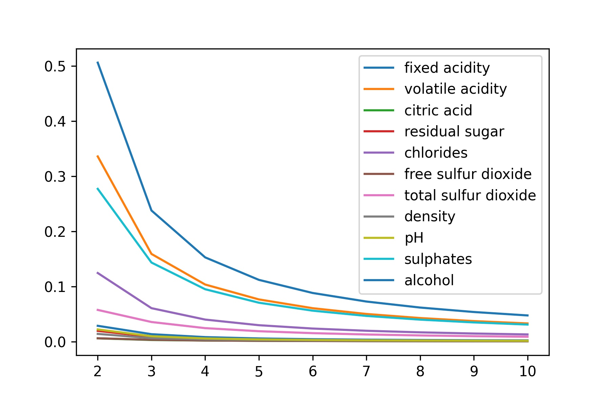

+++
author = "Vinnie"
title = "Sensitivity Analysis"
date = "2020-01-07"
tags = [
    "inference",
    "machine learning",
    "regression",
    'visualization'
]
categories = [
    "inference",
    "machine learning",
]
image = "header.jpg"
+++

Another inference post. I imagine there will be many more of these. 

What variables affect deep NN prediction? Sensitivity Analysis was purposed by Kewley et al. (2000) to answer this question. Here's the gist:

After fitting a model, in this case a deep NN, use the average of every feature for prediction. To test the model's sensitivity to a specific feature, iterate over a range and make predictions at each point, while keeping all other features at their average level. Then, compute the mean squared difference of the predictions and the average sample target value.

Here is how they describe it:

>Once a network has been trained on a large set of input variables, calculate an average value for each input variable. Then, holding all variables but one at a time at their average levels, vary the one input over its entire range and compute the variability produced in the net outputs. Analysis of this variability may be done for several different networks, each trained from a different weight initialization. The algorithm will then rank the variables from highest to lowest according to the mean variability produced in the output.

The range of the feature is where I think this measure gets interesting. The range itself changes. If you scaled the feature [0,1], then any number of range levels is possible. There could be 3 levels (0.33,0.66,0.99) or 10 levels (0.1,0.2,0.3...etc). The sensitivity statistic measures the prediction difference at different feature intervals. Therefore, models are "more sensitive" to features with higher sensitivity at the lower range intervals. Neat

Here are some graphs:

This is using the average levels of each feature for prediction. Like in the VEC analysis, these predictions can be wildly different from run to run. 

Very different.

There is another method, which I used in the VEC post, that helps with this variability. Instead of using the average value, change the entire column of the data to the interval value and grab the average prediction.

This method provides more consitent results.

The authors go on to do significance testing of some sort, but I am not convinced of the efficacy. This is a cool method, but it doesn't provide any information about in what way the feature is affecting the model. This is my primary interest.

Vinnie

